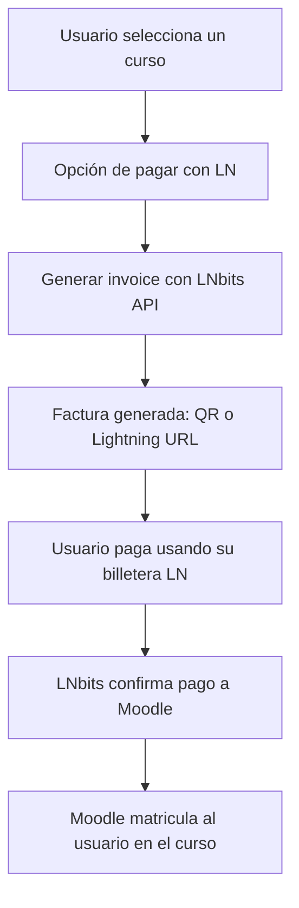

# moodle-payments

## Introducción
El objetivo de este diseño es definir la guía para la creación del plugin de Moodle que permita a los usuarios pagar los cursos mediante Lightning Network utilizando LNbits como proveedor de pagos. Incluye la estructura de archivos, el flujo del proceso de pago y la integración con la API de LNbits. Así como los principales componentes de código que ayudarán posteriormente a desarrollar e implementar la solución en el entorno.

## Desarrollo del plugin de Moodle

Primero, necesitaremos un plugin para realizar pagos en Moodle que interactúe con Lightning Network. Los plugins en Moodle se clasifican por tipologías ([link](https://moodledev.io/docs/4.5/apis/plugintypes))
Moodle ya tiene una estructura para manejar pagos a través de plugins como PayPal o Stripe, y se puede usar como referencia. En principio el tipo de plugin que necesitamos se clasifica dentro de [`enrolment`](https://moodledev.io/docs/4.5/apis/plugintypes/enrol), ya que ahí se gestiona la matriculación en el curso y se asocia el pago por el medio que se requiera.

Aquí dejo lo pasos que pienso podrían hacer falta para conseguir el objetivo:

1. Configurar un plugin de tipo pago:
    - Como hemos visto, en Moodle, los plugins de pago están dentro de la categoría de “enrolment” (matrícula) y por ello el nuestro se basará en dicho tipo.
    - Se creará la estructura básica del plugin en `moodle/enrol/lightning`:
        - Carpeta del plugin: `enrol/lightning`
        - Archivos principales:
            - `db/access.php`
            - `enrol.php`: Contiene la lógica de matrícula para el curso.
            - `settings.php`: Permite configurar opciones del plugin (por ejemplo, la integración con LNbits).
            - `enrol_pluginname.php`: Lenguajes y nombres del plugin dentro del carpeta `lang`.
            - `lib.php`: Funciones de integración.
            - `version.php`: Define la versión y las dependencias del plugin.

2. Configurar el manejo de los pagos:
- Deberá usar las funciones de LNbits API para crear facturas Lightning (invoices). Puede generar una nueva invoice al momento de que el usuario quiera matricularse en el curso.
- Al recibir el pago, la API de LNbits te enviará una confirmación que debes usar para matricular al usuario.

3. Enlazar con el sistema de matriculación de Moodle:
- Es necesario modificar la función `enrol_user()` para matricular automáticamente al usuario cuando se confirme el pago por la factura Lightning.
- Al recibir la confirmación de pago desde LNbits, puedes hacer que el usuario sea registrado en el curso específico.

3. Configurar la interfaz de usuario:
- En la página del curso para pagar usando Lightning Network necesitarás añadir una opción. Esto podría ser un botón que interactúe con LNbits para generar la invoice.
- Deberás usar tecnologías como Ajax para actualizar el estado del pago en tiempo real.

4. Probar el plugin:
- Tras instala el plugin en una instancia de Moodle de prueba, que use monedas de testnet. Deberás verificar que se realice la transacción y que los usuarios se matriculen correctamente después de pagar.
- Una vez lo valides en el entorno de pruebas, se podrá desplegar en producción y trabajar con monedas reales (valorar si es necesario pasar por regtest también antes).

## Desarrollo del plugin de LNbits

LNbits ya tiene una API para crear y manejar invoices. Tu plugin debería ser capaz de conectarse a esta API y manejar la confirmación de los pagos.
Pasos:

1. Crea un plugin en LNbits:
- Desarrolla un plugin de LNbits que pueda generar facturas para cursos en Moodle.
- Este plugin necesitará una integración sencilla con la API de Moodle, o bien, podría enviar las confirmaciones de pago de vuelta a tu servidor Moodle para completar el proceso de matrícula.

2. Integra Moodle y LNbits:
- Al generar una factura en LNbits, el plugin debe enviar el estado del pago a Moodle.
- Usa las API de LNbits para crear y verificar facturas. La API puede notificar a Moodle cuando un pago sea completado (por ejemplo, usando Webhooks).

3. Autenticación y seguridad:
- Asegúrate de que la integración sea segura. LNbits y Moodle deben intercambiar tokens de seguridad o claves API para validar las solicitudes.

3. Pasos Adicionales
- Configura LNbits: Debes tener una instancia de LNbits corriendo, o puedes usar un servidor público. Configura una billetera para recibir los pagos de los cursos.
- Pruebas con regtest o testnet: Puedes probar toda la infraestructura en un entorno de pruebas utilizando regtest o testnet para Lightning Network antes de pasarlo a producción.

Documentación y recursos útiles:
- [Entorno de Desarollo - moodlehq](https://github.com/moodlehq/moodle-docker)
- [Desarrollo de plugins en Moodle]()
- [LNbits API]()

Este enfoque te permitirá crear un plugin de Moodle que use Lightning Network para los pagos y un plugin de LNbits que facilite la integración entre ambas plataformas.

## Estructura del Plugin de Moodle (Lightning Payment)
### Directorio del plugin: moodle/enrol/lightning/
```bash
moodle/
└── enrol/
    └── lightning/
        ├── version.php         # Versión del plugin y dependencias.
        ├── enrol.php           # Lógica de matrícula.
        ├── settings.php        # Configuraciones del plugin (API de LNbits).
        ├── lib.php             # Funciones auxiliares.
        ├── lang                # Archivos de lenguaje.
        │   └── en                          # Archivos en inglés.
        │       └── enrol_pluginname.php     # Archivos para gestionar el idoma ingés.
        ├── classes/
        │   └── invoice_manager.php  # Clase para manejar invoices (con LNbits API).
        └── db/
            └── install.xml     # Estructura de la base de datos (opcional).
```
### Archivo [version.php](https://moodledev.io/docs/4.5/apis/commonfiles#versionphp)

Define el nombre, la versión y las dependencias del plugin, por ejemplo, el número de la versión de Moodle requerida.

<details>
    <summary>version.php file example</summary>
    ```php
    <?php
    // This file is part of Moodle - http://moodle.org/
    //
    // Moodle is free software: you can redistribute it and/or modify
    // it under the terms of the GNU General Public License as published by
    // the Free Software Foundation, either version 3 of the License, or
    // (at your option) any later version.
    //
    // Moodle is distributed in the hope that it will be useful,
    // but WITHOUT ANY WARRANTY; without even the implied warranty of
    // MERCHANTABILITY or FITNESS FOR A PARTICULAR PURPOSE.  See the
    // GNU General Public License for more details.
    //
    // You should have received a copy of the GNU General Public License
    // along with Moodle.  If not, see <http://www.gnu.org/licenses/>.
    
    /**
     * Version metadata for the plugintype_pluginname plugin.
     *
     * @package   enrol_lightning
     * @copyright ifuensan <@ifuensan>
     * @license   http://www.gnu.org/copyleft/gpl.html GNU GPL v3 or later
     */
    
    defined('MOODLE_INTERNAL') || die();
    
    $plugin->version = TODO;
    $plugin->requires = TODO;
    $plugin->supported = TODO;   // Available as of Moodle 3.9.0 or later.
    $plugin->incompatible = TODO;   // Available as of Moodle 3.9.0 or later.
    $plugin->component = 'enrol_lightning';
    $plugin->maturity = MATURITY_STABLE;
    $plugin->release = 'TODO';
    
    $plugin->dependencies = [
        'mod_forum' => 2022042100,
        'mod_data' => 2022042100
    ];
    ```
</details>

### Archivo enrol.php
```php
Gestiona el proceso de inscripción de los usuarios tras recibir confirmación de pago.
function enrol_lightning_plugin_enrol_user($userid, $courseid, $payment_status) {
    if ($payment_status == 'paid') {
        // Enroll user in course if payment confirmed.
        enrol_user($userid, $courseid);
    }
}
```
### Archivo lib.php

Aquí estarán las funciones para interactuar con la API de LNbits y generar facturas.

```
function generate_lightning_invoice($courseid, $amount) {
    // Llama a la API de LNbits para generar una factura.
    $lnbits_api_key = get_config('enrol_lightning', 'lnbits_api_key');
    $url = "https://lnbits.example.com/api/v1/payments";

    $params = [
        'amount' => $amount * 1000,  // Satoshis
        'memo' => 'Payment for course ' . $courseid
    ];

    $ch = curl_init();
    curl_setopt($ch, CURLOPT_URL, $url);
    curl_setopt($ch, CURLOPT_RETURNTRANSFER, true);
    curl_setopt($ch, CURLOPT_POSTFIELDS, json_encode($params));
    curl_setopt($ch, CURLOPT_HTTPHEADER, [
        'Content-Type: application/json',
        'X-Api-Key: ' . $lnbits_api_key
    ]);

    $response = curl_exec($ch);
    curl_close($ch);

    return json_decode($response, true);
}
```
## Integración con LNbits
Componentes principales:

    LNbits API: El plugin de Moodle se conectará a la API de LNbits para generar facturas y obtener el estado de los pagos.
    Webhooks de LNbits: LNbits puede enviar confirmaciones de pago a Moodle, utilizando una URL que reciba los webhooks. Esto se manejará dentro del plugin de Moodle.

Proceso de Pago:

    Generar factura Lightning:
        Al seleccionar un curso y optar por el pago con Lightning, Moodle envía una solicitud a la API de LNbits para generar una factura.
        LNbits responde con una factura (un código QR) que el usuario puede escanear.

    Verificación del pago:
        Moodle usa la API de LNbits para verificar el estado de la factura.
        Una vez que se detecta el pago, Moodle matricula automáticamente al usuario en el curso.
## Diagrama de flujo del proceso de pago



## Webhook para recibir confirmaciones de pago

En el archivo enrol.php, puedes configurar un endpoint en Moodle que reciba la confirmación de pago desde LNbits.
```php
// Endpoint para recibir Webhook de LNbits
function handle_lnbits_webhook() {
    $input = file_get_contents('php://input');
    $data = json_decode($input, true);

    if ($data['status'] == 'paid') {
        $userid = $data['metadata']['userid'];
        $courseid = $data['metadata']['courseid'];
        
        enrol_lightning_plugin_enrol_user($userid, $courseid, 'paid');
    }
}
```

## Configuración del plugin en Moodle
Archivo settings.php

Este archivo proporciona la interfaz para configurar el plugin dentro de Moodle, como agregar la clave API de LNbits.
```php
if ($ADMIN->fulltree) {
    $settings->add(new admin_setting_configtext(
        'enrol_lightning/lnbits_api_key',
        get_string('lnbitsapikey', 'enrol_lightning'),
        get_string('lnbitsapikey_desc', 'enrol_lightning'),
        ''
    ));
}
```

## Ejemplo de conexión entre Moodle y LNbits
```php
$invoice = generate_lightning_invoice($courseid, $courseprice);

if ($invoice) {
    // Muestra el código QR o Lightning URL al usuario
    echo 'Por favor, paga escaneando este código QR:';
    echo '';
}
```
